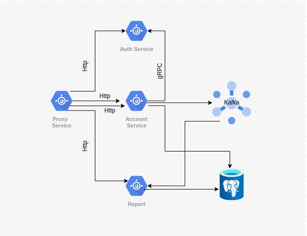
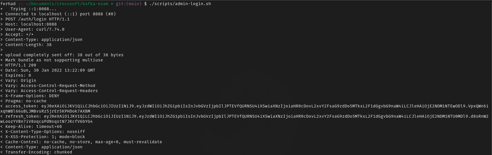
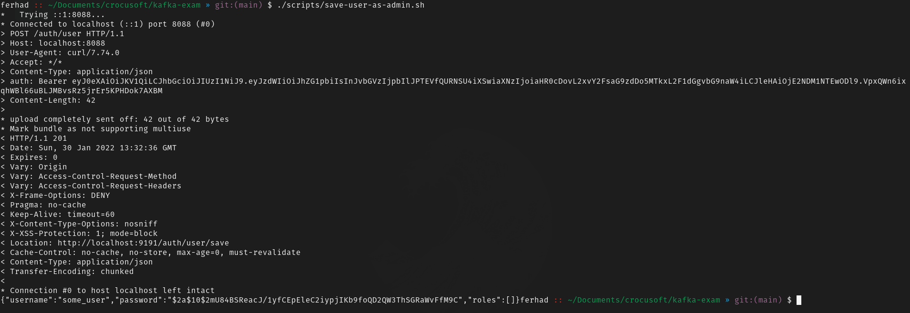
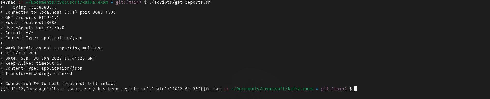

# Microservice Sample Application



## Description
Sample Demo Microservice application built with Spring Stack(Spring Boot, Spring Security), Netflix OSS (Zuul Api Gateway, Eureka Discovery Service), gRPC, PostgreSQL, Jooq, Apache Kafka, JWT, and etc.

This Application uses Jooq for data access layer, Hibernate implementation is also available in branch named hibernate-impl

## Installation
Apache ZooKeeper and Apache Kafka should be installed in the system.
- [Apache ZooKeeper Download](https://zookeeper.apache.org/releases.html)
- [Apache Kafka Download](https://kafka.apache.org/downloads)

## Modules
Project is written using Gradle build tool.

There are 5 modules in the project. To see modules run following command
``` sh
$ gradle projects
```

### Eureka Server (eureka-server)
Holds the information about all client-service applications. Every microservice will register into the Eureka server and Eureka server knows all the client applications running on each port and IP address.

### API Gateway (gateway)
Acts as a reverse proxy to accept all application programming interface (API) calls, aggregate the various services required to fulfill them, and return the appropriate result

### Account Service (account-service)
Handles all database-related processes such as account creation, account validation, and etc.

Plays as gRPC server to Auth Service

Plays as Producer in Producer/Consumer relation in Kafka. For simple demonstration, just produces messages like "Username with 'username' has been registered" 

### Auth Service (auth-service)
Handles all authentication/authorization work. 

Plays as gRPC client to Account Service

### Report Service (report-service)
Plays as Consumer in Producer/Consumer relation in Kafka. It consumes messages which Account Service (Producer) produces like "Username with 'username' has been registered"

### Common (common)
Not microservice. Just holds common dependencies like Protobuf files for gRPC Services.

## Endpoints
There are limited endpoints for testing behavior of microservices
- /auth/login
- /auth/users
- /auth/user/**
- /auth/role/**
- /auth/token/refresh
- /reports

All of endpoints can be accessed by only appropriate accounts. For example, only admin can access /auth/role/**

## Ports
- Eureka Server: 8761
- API Gateway: 8088
- Account Service 
  -- 8090 for Spring Boot
  -- 9898 for gRPC Server
- Auth Service: 9191
- Report Service: 8095

## Compilation and Running
Assuming you run any UN*X system and have Gradle installed, follow below steps

### Running Apache ZooKeeper and Apache Kafka
``` sh
% cd $ZOOKEEPER_HOME
% ./bin/zkServer.sh start
% cd $KAFKA_HOME
% ./bin/kafka-server-start.sh config/server.properties
```

### Configuring PostgreSQL
Application uses **Jooq** instead of **Hibernate** for data access layer which uses database-first paradigm. That's why database should be configured before application starts

*schema.sql* and *data.sql* are available in db directory. *schema.sql* is for creation of tables. *data.sql* is for initial datas of application

``` sh
$ createdb microservices_jooq
$ psql microservices_jooq -a -f db/schema.sql
$ psql microservices_jooq -a -f db/data.sql
```

**Note that in above commands, I omit -u flag. Because I have postgresql user named with my shell user name. If you use different user name from shell user name, explicitly define -u flag**

### Compiling protobuf files for gRPC communication

``` sh
$ gradle :common:jar
```

It will generate Java classes from protobuf files and it will be used as dependency by gRPC services for communication

### Running Eureka Server
``` sh
$ gradle :eureka-server:bootRun
```

Because of being discovery server, Eureka Server should be ran first among all microservices

### Running Account Service
``` sh
$ gradle :account-service:generateJooq
$ gradle :account-service:bootRun
```

Account Service should be ran before Auth Service. Because Account Service is gRPC server for Auth Service

### Running Auth Service
``` sh
$ gradle :auth-service:bootRun
```

### Running Report Service
``` sh
$ gradle :report-service:generateJooq
$ gradle :report-service:bootRun
```

### Running API Gateway
``` sh
$ gradle :gateway:bootRun
```

API Gateway should be ran last

## Simple Demonstration
You can either use Postman to test behavior of microservices, or go with cURL scripts if you have UN\*X system
### Sample Postman Collection
Just export *microservices_demo.postman_collection.json* to Postman

### cURL Scripts
- To login as Admin

``` sh
$ ./scripts/admin-login.sh
```



- To save user as admin

``` sh
$ ./scripts/save-user-as-admin.sh
```



- In this process Account Service (Kafka Producer) sends following message to Report Service (Kafka Consumer), which could be get using **/reports** route

``` sh
$ ./scripts/get-reports.sh
```


